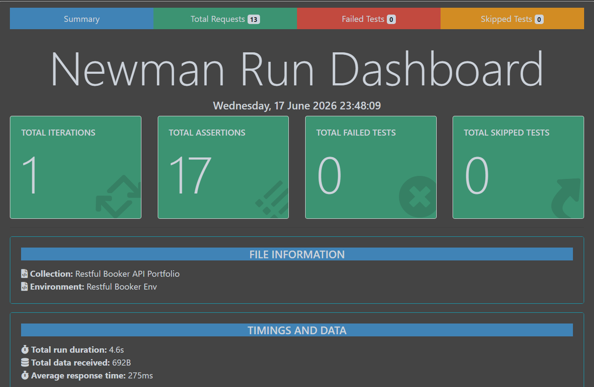
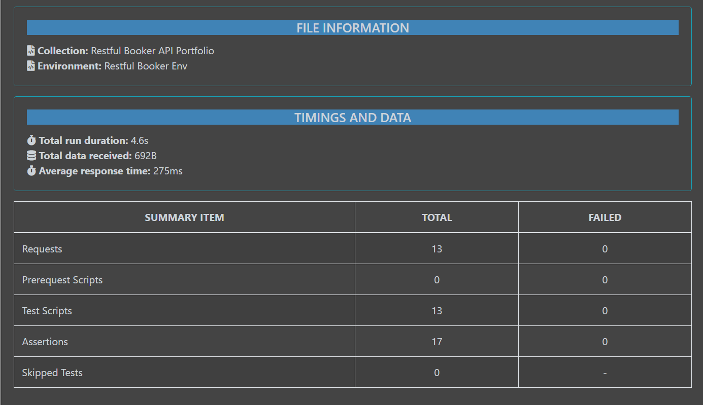
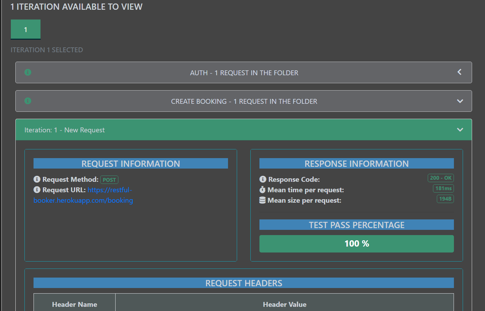
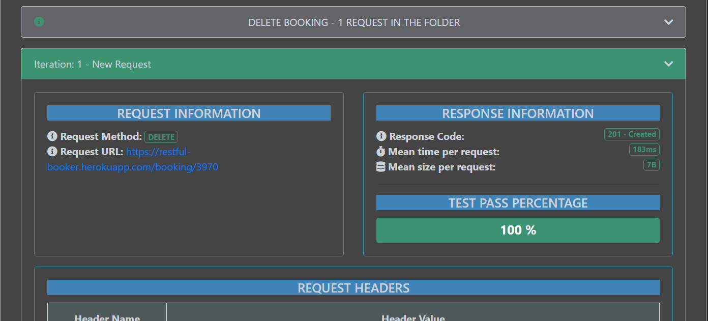
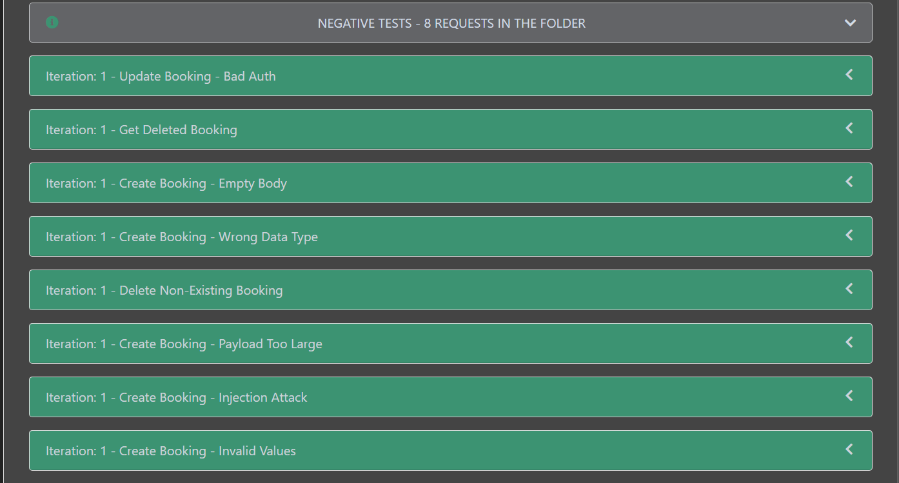
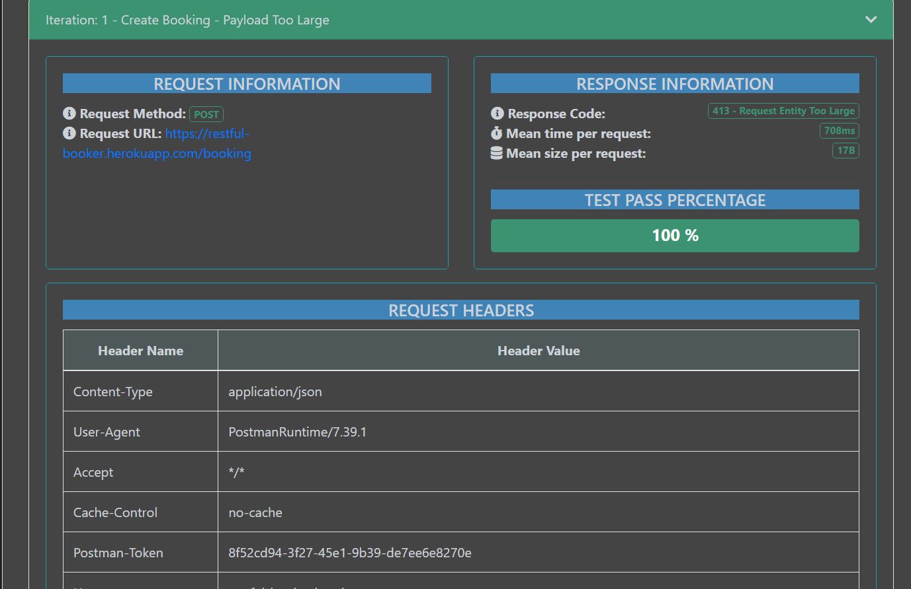
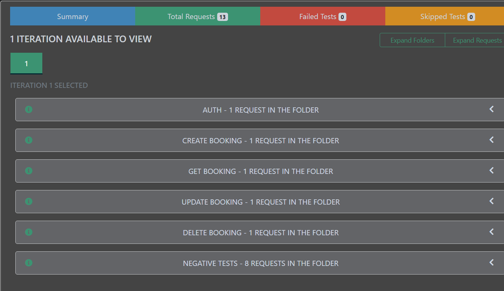

# Restful-Booker API Test Automation

API Automation testing for the [Restful-Booker](https://restful-booker.herokuapp.com/apidoc/index.html) hotel booking API, built with **Postman**, **Newman**, and the **htmlextra** reporter. This portfolio demonstrates a professional approach to API testing — full CRUD coverage, automatic authentication handling, and a dedicated set of negative / edge-case tests.

## 📁 Project Files

| File | Description |
|------|--------------|
| `collection.json` | Postman collection — Auth, CRUD, and Negative Tests |
| `env.json` | Postman environment (`base_url`, `token`, `booking_id`) |
| `Restful Booker API Portfolio-...html` | Full Newman HTML report (download and open in browser) |

## 🗂️ Collection Structure

| # | Folder | Requests | Purpose |
|---|--------|----------|---------|
| 1 | **Auth** | 1 | Authenticates and stores `{{token}}` automatically |
| 2 | **Create Booking** | 1 | Creates a booking, stores `{{booking_id}}` |
| 3 | **Get Booking** | 1 | Retrieves the created booking |
| 4 | **Update Booking** | 1 | Updates the booking using the stored token |
| 5 | **Delete Booking** | 1 | Deletes the booking using the stored token |
| 6 | **Negative Tests** | 8 | Deliberately broken/malicious inputs |

**Total: 13 requests / 17 assertions — 0 failed, 0 skipped.**

No hardcoded URLs are used anywhere in the collection — everything runs through `{{base_url}}`, `{{token}}`, and `{{booking_id}}`.

## 🧪 Negative Test Cases

| Test | What it checks |
|------|-----------------|
| Update Booking – Bad Auth | Rejects request with invalid/expired token |
| Get Deleted Booking | Confirms a deleted resource is no longer retrievable |
| Create Booking – Empty Body | API behavior on an empty POST body |
| Create Booking – Wrong Data Type | String sent where a number is expected |
| Delete Non-Existing Booking | DELETE on an ID that doesn't exist |
| Create Booking – Payload Too Large | Very large string payload (10,000+ chars) |
| Create Booking – Injection Attack | `<script>` / XSS-style payload in a text field |
| Create Booking – Invalid Values | Negative numbers, `null`, and other invalid values |

## 📊 Newman HTML Report — Preview

**File Information & Run Summary:**



**Summary Dashboard:**



**Request/Response Detail View:**



**Folder Breakdown (Auth → CRUD → Negative Tests):**



**Negative Tests Folder:**



**Negative Test Example — Payload Too Large:**



**Total Run Results:**



> 💡 The full interactive HTML report is also available in this repo — download `Restful Booker API Portfolio-...html` and open it in your browser for the complete experience.

## ⚙️ Tech Stack

- **Postman** — collection design, pre-request/test scripting
- **Newman** — CLI test runner
- **newman-reporter-htmlextra** — rich HTML reporting
- **GitHub Actions** — CI pipeline (runs tests automatically on every push)

## ▶️ Running Locally

```bash
npm install -g newman newman-reporter-htmlextra
newman run collection.json -e env.json -r htmlextra
```

## 🔁 Continuous Integration

This repository runs the full Postman collection automatically via **GitHub Actions** on every push, pull request, and on a daily schedule. Check the **Actions** tab of this repo to see live test results and download generated reports.

## 👤 Author

Built as a hands-on QA / API testing portfolio project.
